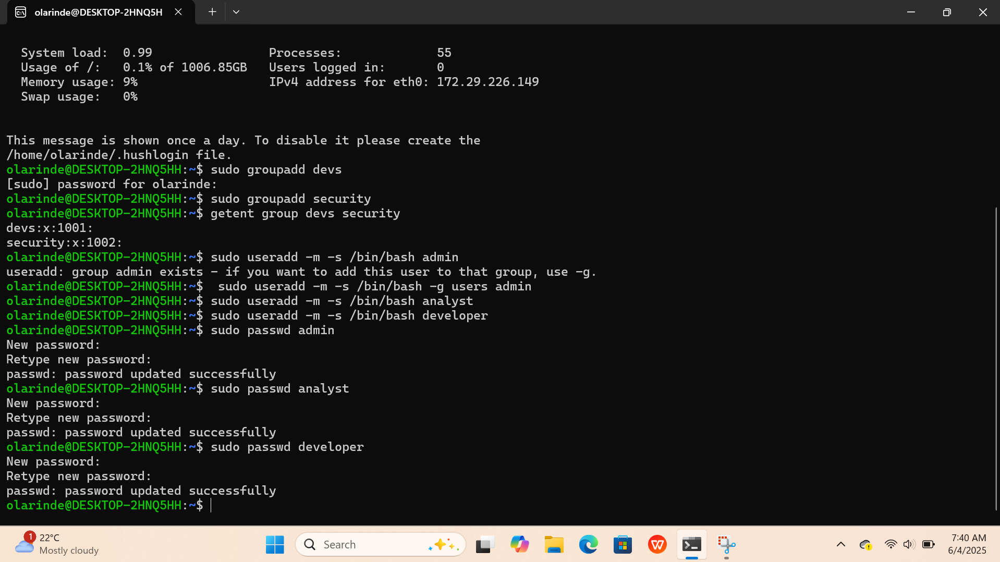

# Project 1: Linux User and Group Permissions

This was my first hands-on Linux project where I learned how to manage users, groups, and file permissions using the command line.

I used Ubuntu (via WSL on Windows) to create different user roles, assign them to groups, and control access to shared folders. It’s a basic but important part of what system and cloud security is all about — giving the right access to the right people.

---

## ✅ What I Worked On

- Created user groups: devs and security
- Added users: admin, analyst, developer
- Assigned each user to their correct group
- Created shared directories: /data/dev and /data/sec
- Set folder permissions using chmod and ownership with chown

---

## 📁 What's Inside

- commands-used.txt — A list of all the commands I ran step by step
- screenshots/ — Proof of work with all terminal screenshots
- README.md — This file you're reading now

---

## 💡 What I Learned

- How to use commands like useradd, groupadd, chmod, chown, and passwd
- How to assign users to groups and restrict access to specific folders
- The importance of access control in securing systems

---

## 📸 Sample Screenshot

---

## 🔗 Follow My Progress

This is just one small step in my journey to becoming a Cloud Security Engineer.  
You can follow more of my work on:

- [GitHub Profile](https://github.com/Akinwale1997)
- [LinkedIn](https://www.linkedin.com/in/olarinde)

---

Thanks for checking out the project!
