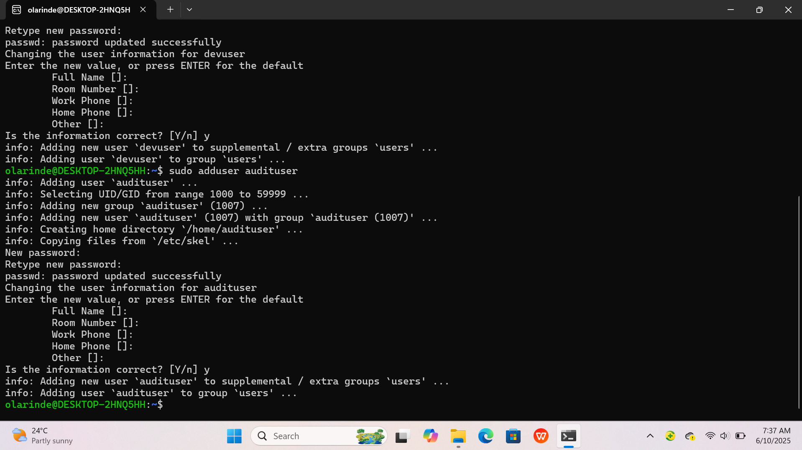
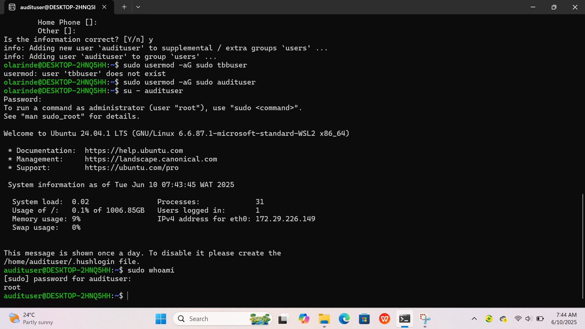
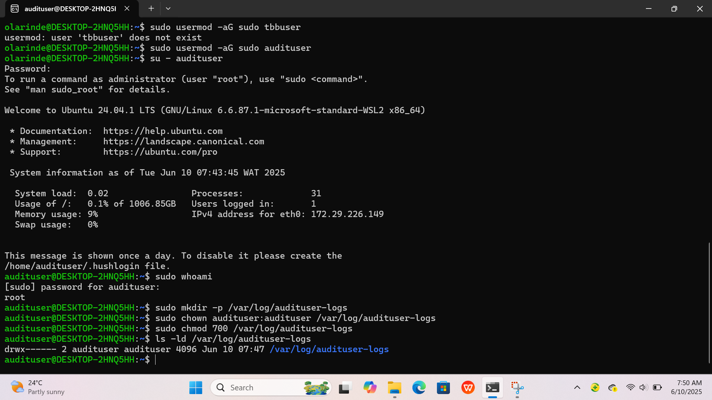

# 👤 Project 3: Creating a Secure Audit User in Linux

In this project, I created a dedicated user called audituser to simulate a secure Linux auditing account. This user was given elevated (sudo) privileges and assigned a private log directory with strict access permissions. 

The goal was to ensure that sensitive audit logs are only accessible by the intended user, enhancing system accountability and security.

---

## 🧠 What I Did

1. Created a new Linux user named audituser.
2. Granted sudo access to the user.
3. Verified administrative privileges using the whoami command.
4. Created a secure log directory: /var/log/audituser-logs.
5. Set strict ownership and permissions so only audituser can access it (chmod 700).

---

## 🔧 Key Commands Used

All terminal commands used in this project are documented in the commands-used.txt file.

---

## 🖼️ Visual Proof (Screenshots)

These screenshots show successful user creation, sudo verification, and permission assignment for the audit logs folder.

---

## 🚀 Why It Matters

This project is a practical demonstration of user management and permission hardening—two foundational skills for any aspiring Linux administrator or cloud security engineer.

It’s also great practice for understanding real-world audit and compliance scenarios.
